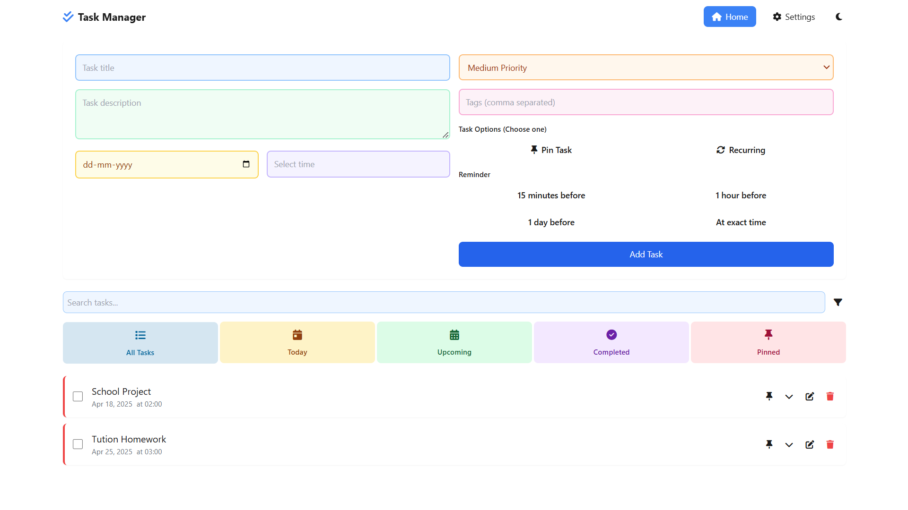

# 📝 Tasky — A Modern Task Management App

**Tasky** is a sleek and modern task management application built with **React** and **TailwindCSS**. Designed for productivity lovers, Tasky makes managing your day-to-day tasks efficient, intuitive, and even fun.

---

## ✨ Features

- ✅ **Create and Manage Tasks**
- 📅 **Set Due Dates and Priorities**
- 🔍 **Filter by Status, Priority, and Tags**
- 🌗 **Dark/Light Theme Support**
- 🏷️ **Categorize Tasks with Tags**
- 📱 **Fully Responsive Design**
- 💾 **Local Storage Data Persistence**

---

## 🌐 Live Demo

Take it for a spin:  
🔗 [Live Demo](https://shoaibxbwf.github.io/Task-Manager/)  

---

## 🤝 Contributing

Have ideas or improvements? Contributions are welcome!

1. Fork the repository  
2. Create a new branch: `git checkout -b feature/YourFeature`  
3. Commit your changes: `git commit -m "Add YourFeature"`  
4. Push your branch: `git push origin feature/YourFeature`  
5. Open a Pull Request and let's collaborate 🚀

---

## 📄 License

This project is licensed under the **MIT License**.
But This is free of charge you can copy/clone for free.
See the [LICENSE](LICENSE) file for full details.

---

## ## 👨‍💻 Developed By

**Mohammad Amir Shoaib**  
💻 BCA Student | Front-End Web Developer  
📧 astechnical112@gmail.com  
🌐 [GitHub: @shoaibxbwf](https://github.com/shoaibxbwf)

> Built with ❤️ using React & TailwindCSS
